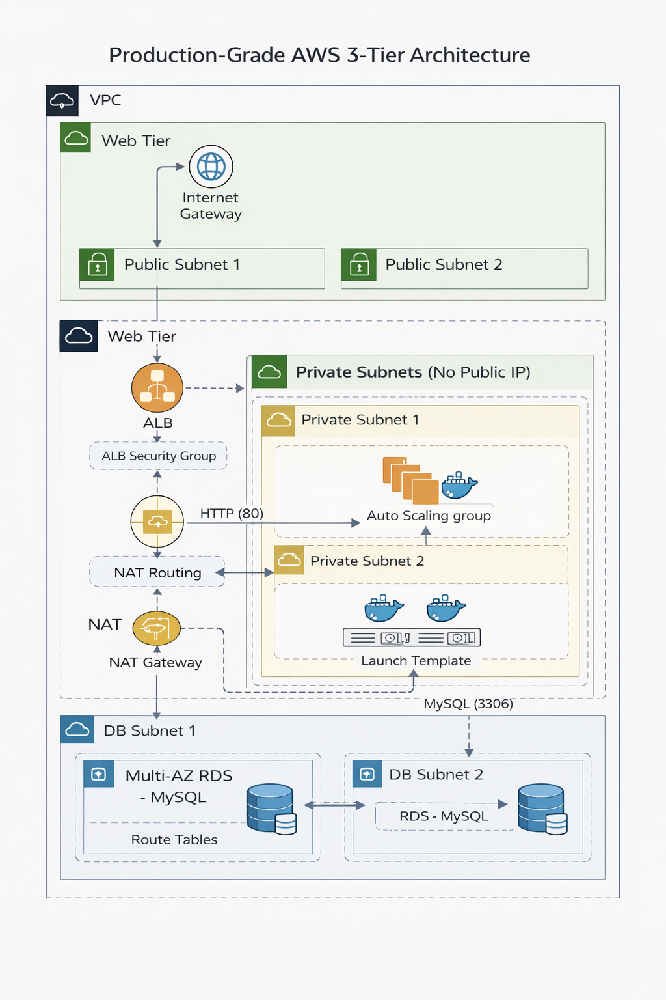
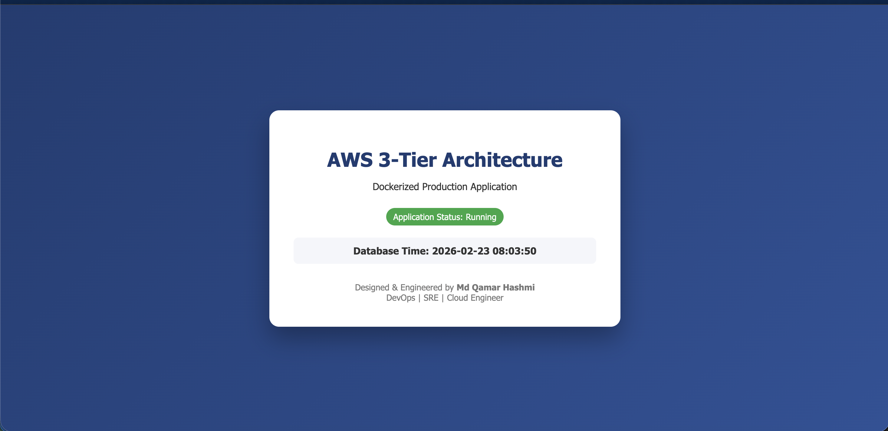

# 🚀 Enterprise 3-Tier Architecture on AWS using Terraform

## 📌 Overview

This repository provisions a production-grade, highly available, and secure 3-tier architecture on AWS using Terraform.

The infrastructure is designed following enterprise best practices:

- Modular Terraform architecture
- Remote state management with locking
- Multi-AZ high availability
- Secure network segmentation
- Auto Scaling for resilience
- Least privilege IAM model

---

## 🏗 Architecture Diagram

Users → Application Load Balancer → Auto Scaling Group (EC2 - Private Subnet) → RDS (Multi-AZ - Private Subnet)



---

## 🧱 Infrastructure Components

### 🌐 Networking
- Custom VPC
- 2 Public Subnets (ALB)
- 2 Private App Subnets (EC2)
- 2 Private DB Subnets (RDS)
- Internet Gateway
- NAT Gateway
- Dedicated Route Tables

### 🚀 Application Layer
- Application Load Balancer
- Target Group
- Launch Template
- Auto Scaling Group
- EC2 Instances in private subnet

### 🗄 Database Layer
- Amazon RDS (MySQL)
- Multi-AZ enabled
- Private subnet deployment
- No public accessibility

---

## 🔐 Security Design

- EC2 instances deployed in private subnets
- RDS isolated in DB subnet group
- IAM roles attached to EC2 (no hardcoded credentials)
- Security groups follow least privilege principle
- No public SSH access
- NAT used for controlled outbound traffic

---

## 🌍 High Availability Strategy

- Multi-AZ deployment
- ALB health checks
- Auto Scaling policies based on CPU utilization
- RDS automatic failover

---

## 🗄 Terraform Remote Backend

State is stored remotely in S3 and locked via DynamoDB to prevent concurrent modifications.

Benefits:
- Team collaboration safety
- State corruption prevention
- Versioned state storage

---

## 💰 Cost Optimization Considerations

- Single NAT Gateway (can upgrade to HA NAT per AZ)
- Right-sized RDS instance
- Configurable Auto Scaling limits
- Environment separation (dev vs prod)

---

## 🚀 Deployment Instructions

### 1️⃣ Initialize
terraform init

### 2️⃣ Validate
terraform validate

### 3️⃣ Plan
terraform plan

### 4️⃣ Apply
terraform apply

---

## Repository Structure

```
terraform/
│
├── modules/
│   ├── vpc/
│   ├── security/
│   ├── rds/
│   ├── alb/
│   └── ec2/
│
├── environments/
│   ├── dev/
│   │   ├── backend.tf
│   │   ├── main.tf
│   │   ├── variables.tf
│   │   └── terraform.tfvars
│   │
│   └── prod/
│       ├── backend.tf
│       ├── main.tf
│       ├── variables.tf
│       └── terraform.tfvars
│
└── versions.tf
```

---

## Dev vs Prod Differences

| Feature | Dev | Prod |
|----------|------|------|
| RDS | Single-AZ | Multi-AZ |
| ASG Capacity | 1–2 instances | 2–4 instances |
| CIDR Range | 10.1.0.0/16 | 10.0.0.0/16 |
| Cost Optimized | Yes | High Availability |

---

## Application Layer

- Flask-based web app
- Dockerized
- Gunicorn production server
- Health endpoint `/health`
- Database connectivity to RDS
- Styled frontend UI

---

## Deployment Instructions

### Deploy Dev

```bash
cd terraform/environments/dev
terraform init
terraform plan
terraform apply
```

### Deploy Prod

```bash
cd terraform/environments/prod
terraform init
terraform plan
terraform apply
```

After successful deployment:

```
alb_dns = xxxx.ap-south-1.elb.amazonaws.com
```

Open the ALB DNS in your browser.

## Live Application Screenshot



---

## Key DevOps Concepts Demonstrated

- Infrastructure as Code (Terraform)
- Modular Terraform design
- Dev/Prod environment separation
- Multi-AZ architecture
- Auto Scaling Groups
- Launch Templates
- User Data automation
- Docker-based deployment
- Secure VPC isolation
- Health checks & ALB integration

---

## 💰 Cost Consideration

Resources created:
- EC2 instances
- RDS instance
- NAT Gateway
- ALB

To avoid charges:

```bash
terraform destroy
```

---

## Resume Highlight

> Designed and deployed a production-grade 3-tier AWS architecture using modular Terraform with Multi-AZ RDS, Auto Scaling, private networking, Dockerized application deployment, and environment separation (dev/prod).

---

## Author

**Md Qamar Hashmi**  
Cloud & DevOps Engineer  
AWS | Kubernetes | Terraform | CI/CD | MLOps  

---
